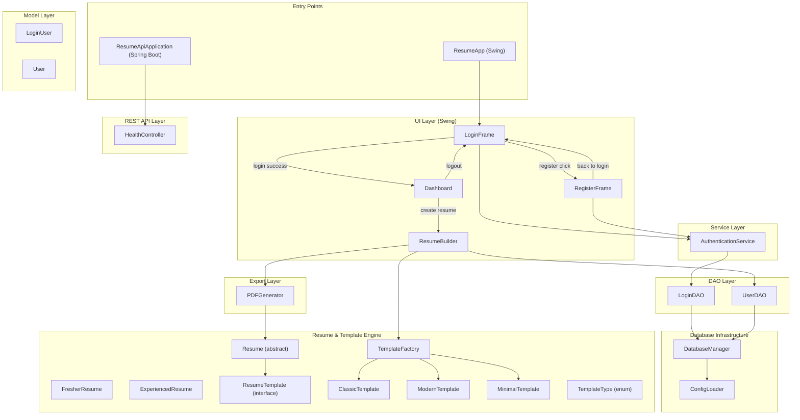
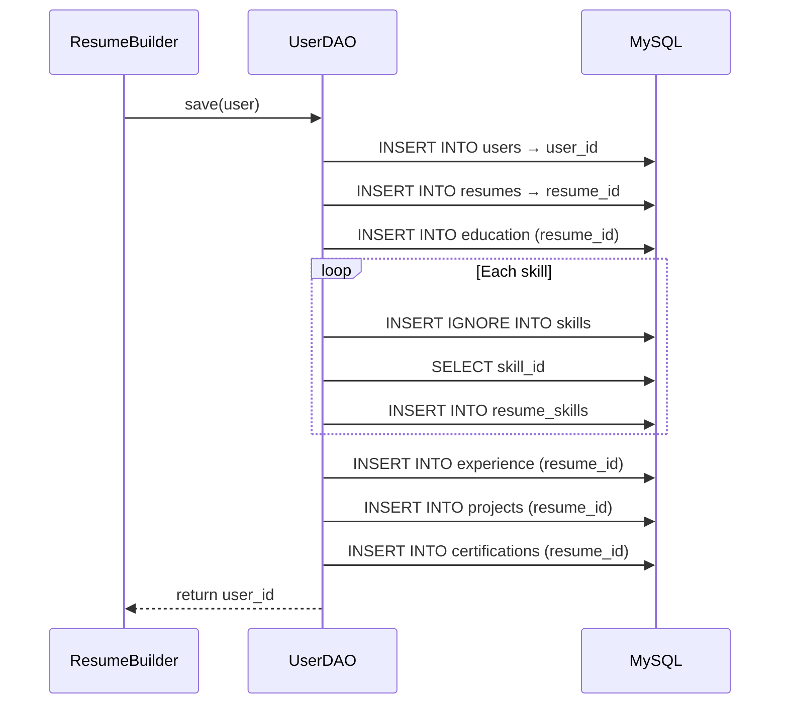
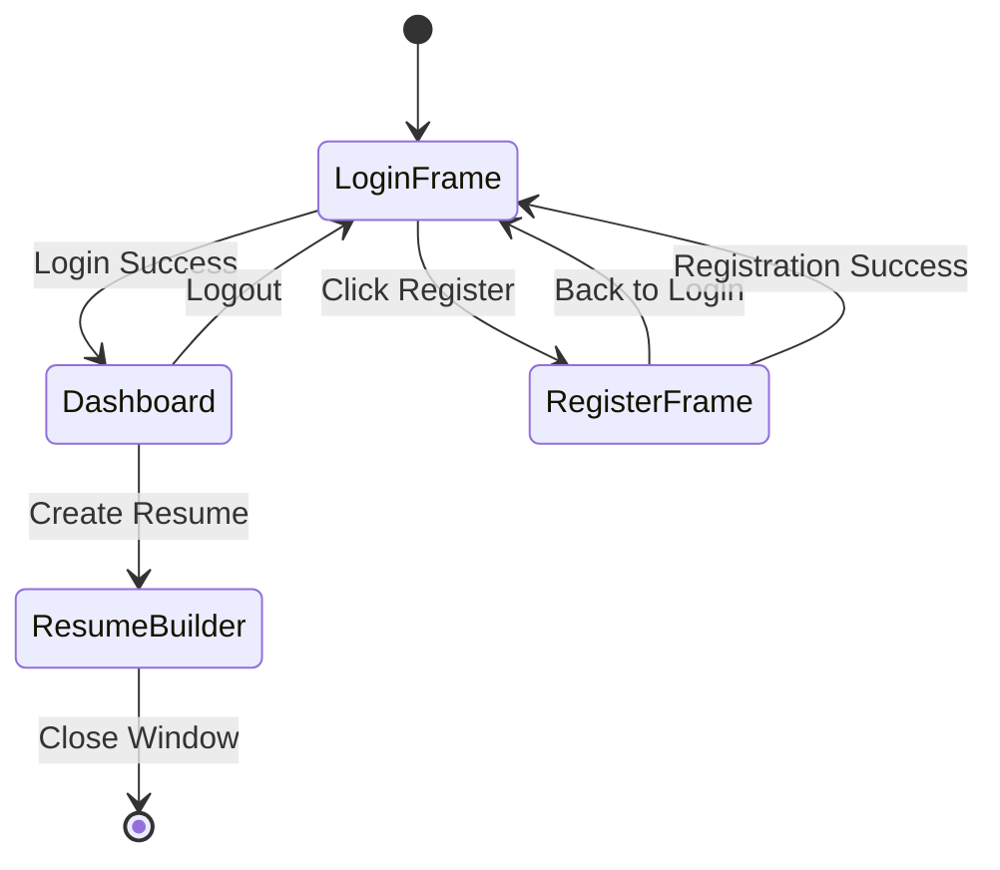
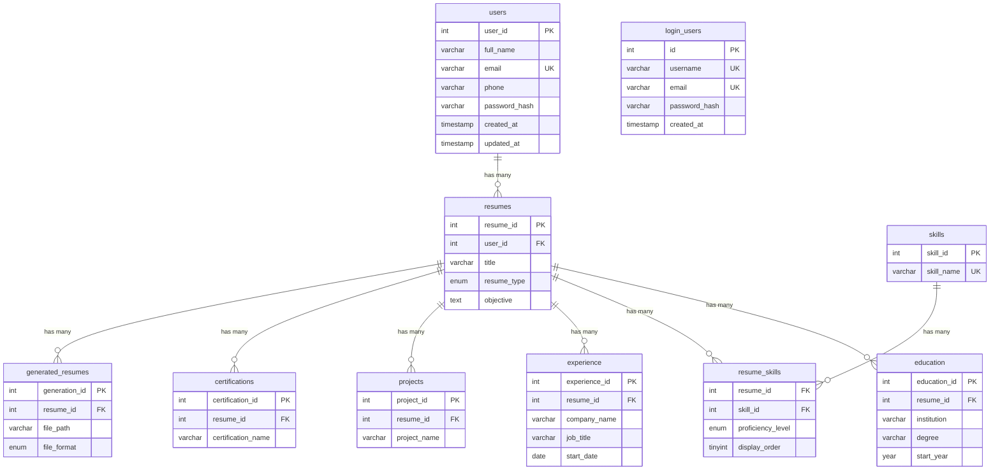
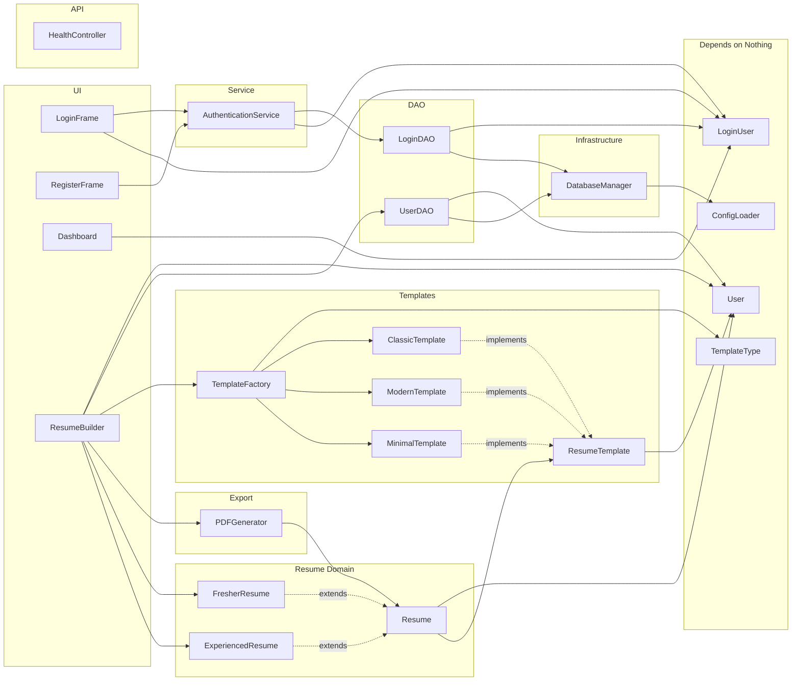

# Resume Generator — Full Codebase Walkthrough

A **Java 17 / Maven** desktop application (Swing GUI) that lets users register, log in, build resumes with selectable templates, save data to MySQL, and export to PDF. A nascent **Spring Boot REST API** layer coexists alongside the Swing client.

---

## Project Identity

| Property | Value |
|---|---|
| Group ID | `com.resumegenerator` |
| Artifact ID | `resume-generator` |
| Java Version | 17 |
| Build Tool | Maven (`pom.xml`) |
| Entry Point (Swing) | [ResumeApp.java](file:///c:/Users/shrut/Downloads/Resume%20Generator/src/com/resumegenerator/ResumeApp.java) |
| Entry Point (REST) | [ResumeApiApplication.java](file:///c:/Users/shrut/Downloads/Resume%20Generator/src/com/resumegenerator/api/ResumeApiApplication.java) |
| Database | MySQL — schema in [schema.sql](file:///c:/Users/shrut/Downloads/Resume%20Generator/db/schema.sql) |

---

## Architecture Overview



---

## Package-by-Package Breakdown

### 1. Root — Entry Point

| File | Purpose |
|---|---|
| [ResumeApp.java](file:///c:/Users/shrut/Downloads/Resume%20Generator/src/com/resumegenerator/ResumeApp.java) | `main()` launches `LoginFrame`. The Swing UI entry point. |

**Application Flow:**
```
ResumeApp.main() → LoginFrame → (login) → Dashboard → ResumeBuilder
                               → (register) → RegisterFrame → LoginFrame
```

---

### 2. `config` — Configuration Loading

| File | Purpose |
|---|---|
| [ConfigLoader.java](file:///c:/Users/shrut/Downloads/Resume%20Generator/src/com/resumegenerator/config/ConfigLoader.java) | Reads `config.properties` from the classpath via a **static initializer block**. Exposes DB credentials (`getUrl()`, `getUsername()`, `getPassword()`, `getDriver()`, `getPoolSize()`) as static methods. |

**Key Design Decisions:**
- Uses `Properties` (hash-table backed) for O(1) lookups
- Fail-fast: throws `RuntimeException` if `config.properties` is missing or unreadable
- Credentials are never hardcoded — externalized in [config.properties](file:///c:/Users/shrut/Downloads/Resume%20Generator/src/config.properties.example)

**Configuration Properties:**
```properties
db.driver=com.mysql.cj.jdbc.Driver
db.url=jdbc:mysql://localhost:3306/resume_builder
db.username=root
db.password=<user-provided>
db.pool.size=5
```

---

### 3. `db` — Database Connection Management

| File | Purpose |
|---|---|
| [DatabaseManager.java](file:///c:/Users/shrut/Downloads/Resume%20Generator/src/com/resumegenerator/db/DatabaseManager.java) | Centralizes JDBC connection open/close. Static initializer loads the MySQL driver via `Class.forName()`. Provides `getConnection()` and `closeConnection()`. |

**Key Design Decisions:**
- Creates a **new connection per call** (no pooling yet, despite `db.pool.size` being configured)
- `closeConnection()` is null-safe and idempotent
- All DAO classes depend on `DatabaseManager` — none call `DriverManager` directly

**Dependency:** `ConfigLoader` → reads credentials → `DriverManager.getConnection()`

---

### 4. `model` — Data Transfer Objects

| File | Purpose |
|---|---|
| [User.java](file:///c:/Users/shrut/Downloads/Resume%20Generator/src/com/resumegenerator/model/User.java) | Resume profile data: name, email, phone, education, skills (`ArrayList<String>`), experience, projects, certifications, objective, experienceYears. **Immutable** (no setters, constructor-only). |
| [LoginUser.java](file:///c:/Users/shrut/Downloads/Resume%20Generator/src/com/resumegenerator/model/LoginUser.java) | Authentication data: userId, username, email, password. **Mutable** POJO with getters/setters + no-arg constructor for ResultSet population. |

> [!IMPORTANT]
> `User` and `LoginUser` are **completely separate models**. `User` carries resume content for the `users` table; `LoginUser` carries credentials for the `login_users` table. They are not linked by a foreign key in the current schema.

---

### 5. `dao` — Data Access Objects

| File | Purpose |
|---|---|
| [LoginDAO.java](file:///c:/Users/shrut/Downloads/Resume%20Generator/src/com/resumegenerator/dao/LoginDAO.java) | CRUD for `login_users` table. `registerUser(LoginUser)` → INSERT, `authenticate(username)` → SELECT by username (returns user with hashed password for BCrypt verification). `userExists()` is a **stub** (always returns `false`). |
| [UserDAO.java](file:///c:/Users/shrut/Downloads/Resume%20Generator/src/com/resumegenerator/dao/UserDAO.java) | Multi-table INSERT for resume data. `save(User)` inserts into `users`, `resumes`, `education`, `skills`/`resume_skills`, `experience`, `projects`, and `certifications` in a single transaction. Also provides `findById()` and `findAll()`. **Largest file in the project (~1165 lines)**. |

**UserDAO `save()` Flow:**


**LoginDAO `authenticate()` Flow:**
```
LoginDAO.authenticate(username)
  → SELECT id, username, email, password_hash FROM login_users WHERE username = ?
  → Returns LoginUser with stored BCrypt hash (or null)
  → AuthenticationService then calls BCrypt.checkpw() to verify
```

---

### 6. `service` — Business Logic

| File | Purpose |
|---|---|
| [AuthenticationService.java](file:///c:/Users/shrut/Downloads/Resume%20Generator/src/com/resumegenerator/service/AuthenticationService.java) | Orchestrates registration and login. Owns all validation logic and BCrypt password hashing. |

**Registration Flow:**
```
AuthenticationService.register(username, email, password, confirmPassword)
  1. validateRegistration() — checks empty fields, password match
  2. loginDAO.userExists(username) — duplicate check (stub)
  3. BCrypt.hashpw(password, BCrypt.gensalt()) — hash the password
  4. loginDAO.registerUser(newLoginUser) — INSERT into login_users
  → returns true/false
```

**Login Flow:**
```
AuthenticationService.login(username, password)
  1. loginDAO.authenticate(username) — SELECT by username
  2. If user == null → return null (user not found)
  3. BCrypt.checkpw(password, user.getPassword()) — verify hash
  4. If match → return LoginUser; else → return null
```

> [!TIP]
> Validation is deliberately placed in the service layer (not the UI) so that the same rules apply regardless of the caller — GUI, CLI, REST API, or unit test.

---

### 7. `resume` — Resume Domain & Template Engine

This package implements a **Strategy + Factory** design pattern for resume templates.

| File | Role |
|---|---|
| [Resume.java](file:///c:/Users/shrut/Downloads/Resume%20Generator/src/com/resumegenerator/resume/Resume.java) | **Abstract base class**. Holds a `User` and a `ResumeTemplate`. Provides `renderWithTemplate()` which delegates to the attached template. Abstract method `getFormattedResume()` for legacy rendering. |
| [FresherResume.java](file:///c:/Users/shrut/Downloads/Resume%20Generator/src/com/resumegenerator/resume/FresherResume.java) | Concrete resume for users with no work experience. `getFormattedResume()` omits experience details. |
| [ExperiencedResume.java](file:///c:/Users/shrut/Downloads/Resume%20Generator/src/com/resumegenerator/resume/ExperiencedResume.java) | Concrete resume for experienced users. `getFormattedResume()` includes experience, projects, certifications. |
| [ResumeTemplate.java](file:///c:/Users/shrut/Downloads/Resume%20Generator/src/com/resumegenerator/resume/ResumeTemplate.java) | **Strategy interface**. Single method: `String render(User user)`. |
| [ClassicTemplate.java](file:///c:/Users/shrut/Downloads/Resume%20Generator/src/com/resumegenerator/resume/ClassicTemplate.java) | Traditional section-based layout with `====` banners and `----` underlines. |
| [ModernTemplate.java](file:///c:/Users/shrut/Downloads/Resume%20Generator/src/com/resumegenerator/resume/ModernTemplate.java) | Compact, scannable layout with `|` separators and `·` skill delimiters. Groups education + certifications into "CREDENTIALS". |
| [MinimalTemplate.java](file:///c:/Users/shrut/Downloads/Resume%20Generator/src/com/resumegenerator/resume/MinimalTemplate.java) | Stripped-down, no banners, plain labeled lines only. |
| [TemplateType.java](file:///c:/Users/shrut/Downloads/Resume%20Generator/src/com/resumegenerator/resume/TemplateType.java) | **Enum**: `CLASSIC`, `MODERN`, `MINIMAL`. Type-safe template identifier. |
| [TemplateFactory.java](file:///c:/Users/shrut/Downloads/Resume%20Generator/src/com/resumegenerator/resume/TemplateFactory.java) | **Factory**: maps `TemplateType` → concrete `ResumeTemplate` instance. The **only** class that knows about concrete template classes by name. |
| [TemplateTest.java](file:///c:/Users/shrut/Downloads/Resume%20Generator/src/com/resumegenerator/resume/TemplateTest.java) | Temporary verification harness (not production code). Proves all three templates render differently from the same `User` data. |

**Template Resolution Flow:**
```
User selects "Modern" in JComboBox
  → selectedTemplateType = TemplateType.MODERN
  → TemplateFactory.create(MODERN) → new ModernTemplate()
  → resume.setTemplate(modernTemplate)
  → PDFGenerator.createPDF(resume, filename)
       → resume.renderWithTemplate()
            → template.render(user) → formatted string
       → iText writes string to PDF
```

---

### 8. `export` — PDF Generation

| File | Purpose |
|---|---|
| [PDFGenerator.java](file:///c:/Users/shrut/Downloads/Resume%20Generator/src/com/resumegenerator/export/PDFGenerator.java) | Two overloads: `createPDF(String, fileName)` for raw content, and `createPDF(Resume, fileName)` which calls `resume.renderWithTemplate()` first. Uses **iText 5.5.13.3** (`Document`, `PdfWriter`, `Paragraph`). |

---

### 9. `ui` — Swing GUI Layer

| File | Purpose |
|---|---|
| [LoginFrame.java](file:///c:/Users/shrut/Downloads/Resume%20Generator/src/com/resumegenerator/ui/LoginFrame.java) | Login screen with username/password fields. Calls `AuthenticationService.login()`. On success → `dispose()` + `new Dashboard(user)`. On failure → generic error message (no username enumeration). |
| [RegisterFrame.java](file:///c:/Users/shrut/Downloads/Resume%20Generator/src/com/resumegenerator/ui/RegisterFrame.java) | Registration screen with username, email, password, confirm-password. Calls `AuthenticationService.register()`. Handles `IllegalArgumentException` (validation) and `SQLException` (DB errors, including MySQL error code `1062` for duplicates). |
| [Dashboard.java](file:///c:/Users/shrut/Downloads/Resume%20Generator/src/com/resumegenerator/ui/Dashboard.java) | Post-login hub. Shows "Welcome, `<username>`!". Two buttons: "Create Resume" → `new ResumeBuilder()` (Dashboard stays open), "Logout" → `dispose()` + `new LoginFrame()`. Receives `LoginUser` via constructor injection. |
| [ResumeBuilder.java](file:///c:/Users/shrut/Downloads/Resume%20Generator/src/com/resumegenerator/ui/ResumeBuilder.java) | Main form with 9 input fields + template dropdown + "Experienced?" checkbox. Two action buttons: **"Generate Resume"** (builds `User` → `Resume` → `PDFGenerator`) and **"Save to Database"** (builds `User` → `UserDAO.save()`). Includes email regex and phone validation. |

**UI Navigation Map:**


---

### 10. `api` — Spring Boot REST Layer

| File | Purpose |
|---|---|
| [ResumeApiApplication.java](file:///c:/Users/shrut/Downloads/Resume%20Generator/src/com/resumegenerator/api/ResumeApiApplication.java) | Spring Boot main class (`@SpringBootApplication`). Scans `com.resumegenerator` for components. Runs with `mvn spring-boot:run` on port 8080. |
| [HealthController.java](file:///c:/Users/shrut/Downloads/Resume%20Generator/src/com/resumegenerator/api/HealthController.java) | `GET /api/health` → `{"status": "UP", "application": "Resume Builder API"}`. Simple liveness check. |

> [!NOTE]
> The REST API is a **skeleton** — only a health endpoint exists. It coexists with the Swing app via separate `main()` methods. The `/api` prefix is reserved for future React frontend integration.

---

## Database Schema (10 Tables)



---

## External Dependencies

| Library | Version | Purpose | Used By |
|---|---|---|---|
| **iText 5** | 5.5.13.3 | PDF generation (`Document`, `PdfWriter`, `Paragraph`) | [PDFGenerator](file:///c:/Users/shrut/Downloads/Resume%20Generator/src/com/resumegenerator/export/PDFGenerator.java) |
| **MySQL Connector/J** | 9.1.0 | JDBC driver for MySQL (runtime scope) | [DatabaseManager](file:///c:/Users/shrut/Downloads/Resume%20Generator/src/com/resumegenerator/db/DatabaseManager.java) |
| **jBCrypt** | 0.4 | Password hashing (BCrypt algorithm) | [AuthenticationService](file:///c:/Users/shrut/Downloads/Resume%20Generator/src/com/resumegenerator/service/AuthenticationService.java) |
| **Spring Boot Starter Web** | 3.2.5 | Embedded Tomcat, REST controllers, JSON serialization | [ResumeApiApplication](file:///c:/Users/shrut/Downloads/Resume%20Generator/src/com/resumegenerator/api/ResumeApiApplication.java), [HealthController](file:///c:/Users/shrut/Downloads/Resume%20Generator/src/com/resumegenerator/api/HealthController.java) |

---

## Complete Module Dependency Map



---

## End-to-End Data Flows

### Flow 1: User Registration
```
RegisterFrame → AuthenticationService.register()
  → validateRegistration() (empty fields, password match)
  → LoginDAO.userExists() (stub — always false)
  → BCrypt.hashpw(password) → hashed password
  → LoginDAO.registerUser(LoginUser) → INSERT INTO login_users
  → success/failure → UI dialog
```

### Flow 2: User Login
```
LoginFrame → AuthenticationService.login(username, password)
  → LoginDAO.authenticate(username) → SELECT from login_users
  → BCrypt.checkpw(password, storedHash)
  → Returns LoginUser or null
  → Success: dispose() → new Dashboard(user)
  → Failure: "Invalid username or password" dialog
```

### Flow 3: Resume Generation (PDF)
```
ResumeBuilder → validateInput() → build User object from form
  → isExperienced? → FresherResume(user) or ExperiencedResume(user)
  → TemplateFactory.create(selectedTemplateType) → ResumeTemplate
  → resume.setTemplate(template)
  → PDFGenerator.createPDF(resume, fileName)
       → resume.renderWithTemplate() → template.render(user) → String
       → iText: Document → PdfWriter → Paragraph(content) → .pdf file
```

### Flow 4: Save to Database
```
ResumeBuilder → validateInput() → build User object from form
  → UserDAO.save(user)
       → INSERT INTO users → user_id
       → INSERT INTO resumes → resume_id
       → INSERT INTO education
       → For each skill: INSERT IGNORE skills → SELECT skill_id → INSERT resume_skills
       → INSERT INTO experience (if experienced)
       → INSERT INTO projects
       → INSERT INTO certifications
  → Display generated user_id
```

---

## Design Patterns Used

| Pattern | Where | Purpose |
|---|---|---|
| **Strategy** | `ResumeTemplate` interface + `ClassicTemplate`, `ModernTemplate`, `MinimalTemplate` | Swap rendering logic at runtime without modifying `Resume` |
| **Factory Method** | `TemplateFactory.create(TemplateType)` | Centralize template instantiation; decouple UI from concrete classes |
| **Template Method** | `Resume.getFormattedResume()` (abstract) | Subclasses define formatting; base class provides structure |
| **DAO** | `UserDAO`, `LoginDAO` | Isolate all SQL from business logic and UI code |
| **MVC-ish Layering** | UI → Service → DAO → DB | Each layer has a single responsibility |
| **Dependency Injection** (manual) | `Dashboard(LoginUser user)` | Constructor injection of the authenticated user |

---

## Key Files Quick Reference

| Layer | Files |
|---|---|
| **Entry** | [ResumeApp.java](file:///c:/Users/shrut/Downloads/Resume%20Generator/src/com/resumegenerator/ResumeApp.java), [ResumeApiApplication.java](file:///c:/Users/shrut/Downloads/Resume%20Generator/src/com/resumegenerator/api/ResumeApiApplication.java) |
| **Config** | [ConfigLoader.java](file:///c:/Users/shrut/Downloads/Resume%20Generator/src/com/resumegenerator/config/ConfigLoader.java), [config.properties.example](file:///c:/Users/shrut/Downloads/Resume%20Generator/src/config.properties.example), [application.properties](file:///c:/Users/shrut/Downloads/Resume%20Generator/src/application.properties) |
| **Database** | [DatabaseManager.java](file:///c:/Users/shrut/Downloads/Resume%20Generator/src/com/resumegenerator/db/DatabaseManager.java), [schema.sql](file:///c:/Users/shrut/Downloads/Resume%20Generator/db/schema.sql) |
| **Models** | [User.java](file:///c:/Users/shrut/Downloads/Resume%20Generator/src/com/resumegenerator/model/User.java), [LoginUser.java](file:///c:/Users/shrut/Downloads/Resume%20Generator/src/com/resumegenerator/model/LoginUser.java) |
| **DAO** | [UserDAO.java](file:///c:/Users/shrut/Downloads/Resume%20Generator/src/com/resumegenerator/dao/UserDAO.java), [LoginDAO.java](file:///c:/Users/shrut/Downloads/Resume%20Generator/src/com/resumegenerator/dao/LoginDAO.java) |
| **Service** | [AuthenticationService.java](file:///c:/Users/shrut/Downloads/Resume%20Generator/src/com/resumegenerator/service/AuthenticationService.java) |
| **Resume** | [Resume.java](file:///c:/Users/shrut/Downloads/Resume%20Generator/src/com/resumegenerator/resume/Resume.java), [FresherResume.java](file:///c:/Users/shrut/Downloads/Resume%20Generator/src/com/resumegenerator/resume/FresherResume.java), [ExperiencedResume.java](file:///c:/Users/shrut/Downloads/Resume%20Generator/src/com/resumegenerator/resume/ExperiencedResume.java) |
| **Templates** | [ResumeTemplate.java](file:///c:/Users/shrut/Downloads/Resume%20Generator/src/com/resumegenerator/resume/ResumeTemplate.java), [ClassicTemplate.java](file:///c:/Users/shrut/Downloads/Resume%20Generator/src/com/resumegenerator/resume/ClassicTemplate.java), [ModernTemplate.java](file:///c:/Users/shrut/Downloads/Resume%20Generator/src/com/resumegenerator/resume/ModernTemplate.java), [MinimalTemplate.java](file:///c:/Users/shrut/Downloads/Resume%20Generator/src/com/resumegenerator/resume/MinimalTemplate.java), [TemplateFactory.java](file:///c:/Users/shrut/Downloads/Resume%20Generator/src/com/resumegenerator/resume/TemplateFactory.java), [TemplateType.java](file:///c:/Users/shrut/Downloads/Resume%20Generator/src/com/resumegenerator/resume/TemplateType.java) |
| **Export** | [PDFGenerator.java](file:///c:/Users/shrut/Downloads/Resume%20Generator/src/com/resumegenerator/export/PDFGenerator.java) |
| **UI** | [LoginFrame.java](file:///c:/Users/shrut/Downloads/Resume%20Generator/src/com/resumegenerator/ui/LoginFrame.java), [RegisterFrame.java](file:///c:/Users/shrut/Downloads/Resume%20Generator/src/com/resumegenerator/ui/RegisterFrame.java), [Dashboard.java](file:///c:/Users/shrut/Downloads/Resume%20Generator/src/com/resumegenerator/ui/Dashboard.java), [ResumeBuilder.java](file:///c:/Users/shrut/Downloads/Resume%20Generator/src/com/resumegenerator/ui/ResumeBuilder.java) |
| **API** | [HealthController.java](file:///c:/Users/shrut/Downloads/Resume%20Generator/src/com/resumegenerator/api/HealthController.java) |
| **Build** | [pom.xml](file:///c:/Users/shrut/Downloads/Resume%20Generator/pom.xml) |
